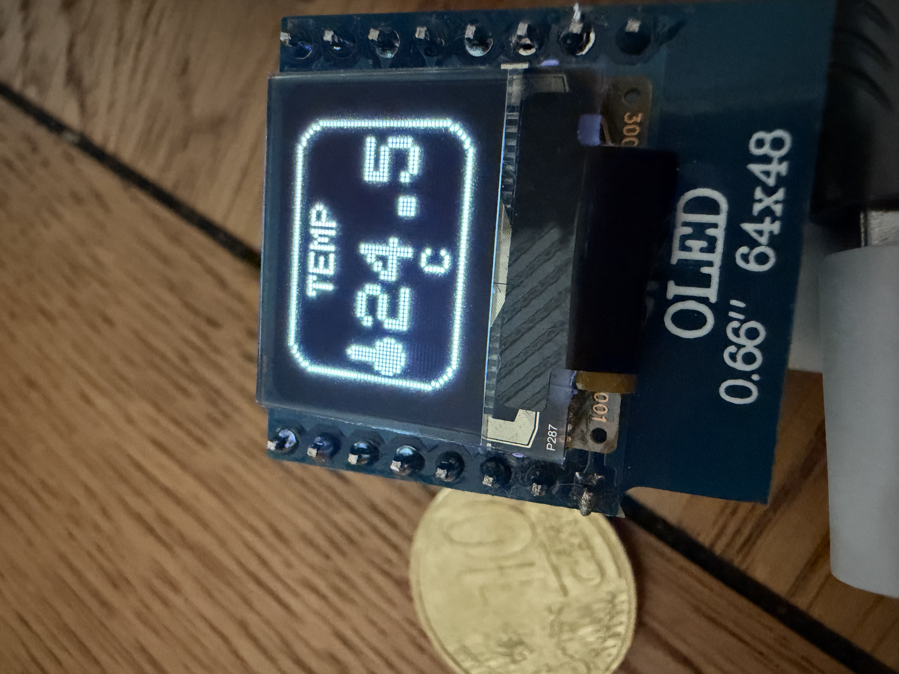

# Meteo Station V1.0.0 — D1 mini + BME280 + OLED 64x48

Connected weather station: a Wemos D1 mini (ESP8266) reads a BME280 sensor
(temperature, humidity, pressure) and displays the values on a 0.66"
64x48 SSD1306 OLED screen, with a small local web server (dashboard + JSON
API + history).



## Hardware

- Wemos D1 mini (ESP8266)
- BME280 sensor (I2C)
- 0.66" 64x48 SSD1306 OLED screen (I2C)
- **Data** micro-USB cable (not a "charge only" cable)

## Wiring (shared I2C bus)

| Signal | D1 mini      | BME280 | OLED |
|--------|--------------|--------|------|
| SDA    | D2 (GPIO4)   | SDA    | SDA  |
| SCL    | D1 (GPIO5)   | SCL    | SCL  |
| VCC    | 3V3          | VCC    | VCC  |
| GND    | GND          | GND    | GND  |

The BME280 and the OLED share the same I2C bus (different addresses:
BME280 on `0x76` or `0x77`, OLED on `0x3C`).

## Software prerequisites

- [PlatformIO](https://platformio.org/) (CLI or VS Code extension)
- On macOS, the **CH340** driver so the D1 mini's serial port is recognized:
  ```bash
  brew install --cask wch-ch34x-usb-serial-driver
  ```
  Approve it under System Settings -> Privacy & Security, then restart the
  Mac.

## Build and flash

```bash
pio device list                 # find the port (e.g. /dev/cu.usbserial-110)
pio run                          # build
pio run -t upload --upload-port /dev/cu.usbserial-XXXX
pio device monitor -p /dev/cu.usbserial-XXXX -b 115200   # serial logs
```

## WiFi setup (first boot)

WiFi credentials are not hardcoded: the firmware uses **WiFiManager** with
a captive portal. On first boot (and every time it doesn't have working
credentials), the D1 mini does **not** join your home network by itself —
it creates its **own** temporary access point, and you connect to that AP
first to hand it your real WiFi credentials.

**How to connect the first time, via the AP created by the device:**

1. Power on the D1 mini. If it has no saved WiFi (or can't reconnect), it
   starts broadcasting its own WiFi network named **`D1mini-Meteo`** (open,
   no password). The OLED confirms this with a WiFi icon and the network
   name.
2. On your Mac/phone, open WiFi settings and join **`D1mini-Meteo`** like
   any other WiFi network.
3. Once connected to it, a configuration page should pop up automatically
   (captive portal). If it doesn't, open a browser and go to
   `http://192.168.4.1`.
4. In that page, pick your usual home WiFi network from the scanned list
   and enter its password, then save.

The D1 mini then reboots, joins your home network with those credentials,
and its own `D1mini-Meteo` AP disappears. Reconnect your Mac/phone to your
normal WiFi network — the device is now reachable at `http://meteo.local`
(see below). Credentials are kept in flash permanently, so this whole
AP-connection step only needs to happen once.

To force a WiFi reconfiguration (switch networks), erase the flash and
reflash:
```bash
pio run -t erase --upload-port /dev/cu.usbserial-XXXX
pio run -t upload --upload-port /dev/cu.usbserial-XXXX
```

## Usage

### Boot splash screen

On every power-up, before anything else runs, the OLED briefly shows a
splash screen (cloud icon, "METEO STATION", version, "by Cypher") for
about 2.5 seconds.

### OLED screen

Three screens loop continuously (horizontal slide every 3s): temperature,
humidity, pressure. Each one shows an icon, a rounded-corner frame, and the
value in large text.

While waiting for WiFi configuration, a dedicated screen shows a WiFi icon
and the name of the access point to join.

### Web dashboard

Once connected to your WiFi network:

- `http://meteo.local` — HTML page with the 3 current values (refreshed
  every 5s via JS, without reloading the page) and a small chart per
  measurement over the last hour
- `http://meteo.local/data` — JSON of the current values:
  ```json
  {"temperature":22.5,"humidity":45,"pressure":1013}
  ```
- `http://meteo.local/history` — JSON of the history series (1 point per
  minute, 60 points max):
  ```json
  {"temperature":[...],"humidity":[...],"pressure":[...]}
  ```

If `meteo.local` doesn't resolve (mDNS isn't supported on some networks),
use the IP address printed in the serial logs at boot.

## Notable technical details

- **Non-standard 64x48 OLED**: the Adafruit_SSD1306 library doesn't
  natively know this resolution. Its default COM config (0x02) overlaps
  the bottom rows onto the top ones. The firmware forces the correct value
  (`0x12`) right after `display.begin()` ([src/main.cpp](src/main.cpp)).
- **Horizontal column offset**: for `WIDTH == 64`, the library already
  handles a column offset internally (the SSD1306 controller addresses 128
  columns, this panel only exposes 64, centered) — no adjustment needed on
  the application side.
- **Off-screen bitmap rendering**: each screen (temp/humidity/pressure) is
  pre-rendered once into a `GFXcanvas1`; the slide animation just moves
  these frozen bitmaps around, never redrawing text mid-motion (smoother,
  much lighter on the CPU).
- **BME280 self-heating**: the sensor is stacked directly on the D1 mini,
  right next to the voltage regulator and the ESP8266 chip, which heat up
  during operation. A software offset (`TEMP_OFFSET_C`, currently -6.3°C)
  approximately compensates for this. For a more reliable reading, move
  the sensor a few cm away from the D1 mini with wires instead of relying
  on this offset.
- **Fast I2C mode** (400kHz) for a shorter OLED refresh time.
- **In-RAM history**: circular buffer of 60 points (1/minute), so it's
  lost on every reboot — no persistence across resets yet.

## Project structure

```
platformio.ini   # PlatformIO configuration (board, libraries)
src/main.cpp     # complete firmware
LICENSE          # MIT license
```

## License

MIT — see [LICENSE](LICENSE).

## Possible improvements

- Persist the history (LittleFS) to survive reboots
- Longer/configurable history window
- A "reconfigure WiFi" button on the web page (`wifiManager.resetSettings()`)
  instead of having to reflash
- Export data to an external service (MQTT, InfluxDB, Home Assistant...)
